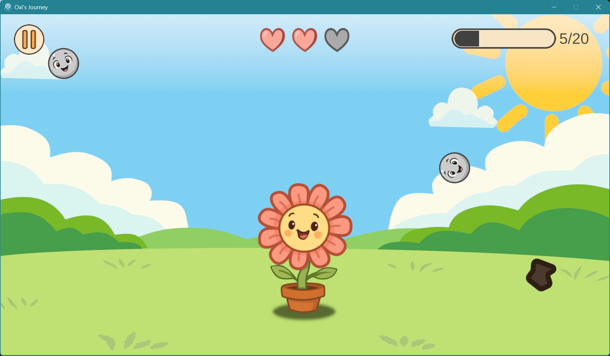
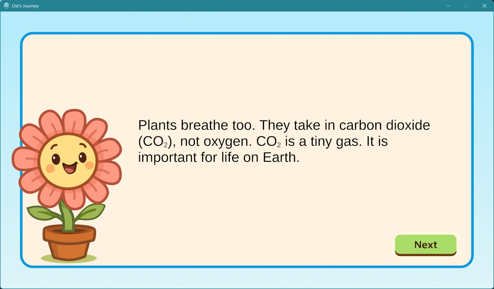
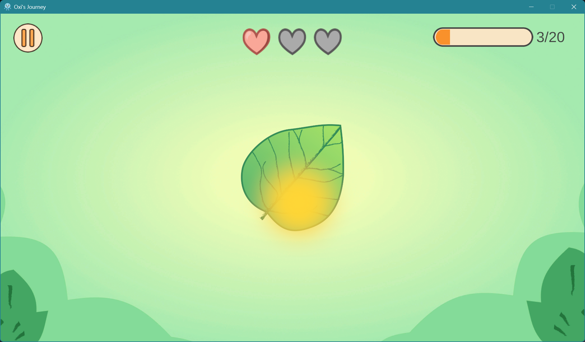
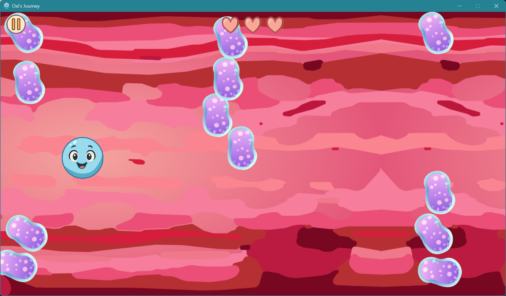

# Oxi’s Journey

A short educational game about the CO₂–O₂ cycle. Guide Oxi through three minigames that show how plants turn CO₂ into O₂, and how animals use O₂ and release CO₂. Between stages, short info screens explain the science behind what you just played.

## How to Play

### 1) Feed the Plant
- Drag CO₂ onto the plant to score.
- Move pollution away.
- Mistakes cost lives.
- Reach the score goal to continue.

### 2) Sunlight Rhythm
- Click when a sunray is above the plant to score.
- Do not click when pollution appears.
- Missing or wrong clicks cost lives.

### 3) Oxygen Dash
- Hold the mouse button and drag up/down through the bloodstream.
- Avoid bacteria and reach the finish cell.

## Controls
- Left mouse button: drag/click

## Win/Lose
Each minigame has limited lives. Losing all lives ends the run. Finishing Oxygen Dash completes the cycle.

## Screenshots

  
  

  
  

  

